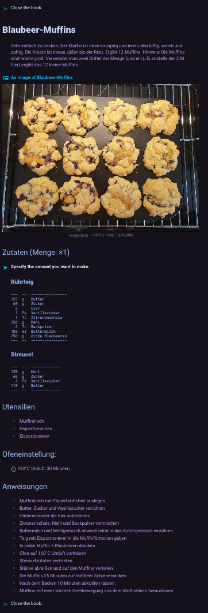
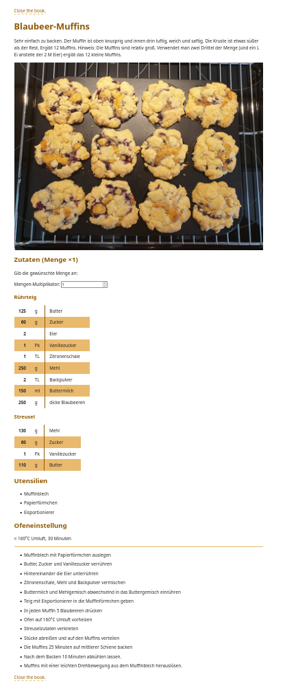

# rezept

This is a generator that takes input recipe files in Markdown and translates them into files that can be read by a web browser.
Currently, it can produce HTML and gemini output.

The gemini files are cgi scripts that can be served from a [SpaceCafe server](https://github.com/Eroica/SpaceCafe), a server for the [gemini protocol](https://geminiprotocol.net/). The gemini protocol is used by gemini browsers such as [lagrange](https://github.com/skyjake/lagrange) for Linux/Mac or [Gemicom](https://github.com/Eroica/Gemicom) for Android phones.

**EDIT 2025-10-04**: I have finally added a generator for HTML as well.

### Motivation
Available online recipe sites often require you to fill in information that I don’t want to think about when writing the recipe, e.g. the overall time requirements. Additionally, they are bloated with cookie banners, ads, comment section etc.

I was in search of a way to write down my recipes that is not more time-consuming than the pen-and-paper approach but makes them accessible from everywhere. So my top priorities for this project are the following:

* Reduce write-overhead for each new recipe. Consequently, keep characters superfluous to the recipe to a minimum.
* Ensure that the input document itself is also perfectly readable.
* Produce simplistic and readable sites.
* Enable global design changes for recipes.

As a result, I can now write my recipes as simple markdown files (see my collection [here](https://github.com/my-tien/rezept)) and then run them through the **recipe_site_generator**.

# Gemini Server Setup
1. Setup a SpaceCafe server
2. Install this package on the server.
3. Configure your spacebeans conf:

     ```
     directories = [
        { path = "url/path/to/your/gemtext-recipe-folder/", allow-cgi = true }
     ]

     environment = {
         "RECIPE_FILESYSTEM_ROOT": "/filesystem-path/to/your/gemtext-recipe-folder"
     }
     ```

4. Write your recipes
5. Run 

# Translating Markdown recipe files to HTML/Gemtext

HTML:
```
$ generate_html_recipes INPUT_RECIPE_FOLDER INPUT_IMAGE_FOLDER [--out OUTPUT_FOLDER] [--overwrite]
```

Gemtext:
```
$ generate_gemtext_recipes INPUT_RECIPE_FOLDER INPUT_IMAGE_FOLDER [--out OUTPUT_FOLDER] [--overwrite]
```

INPUT_RECIPE_FOLDER: A folder with your input markdown recipes (see section below on how to write the input recipe files). The folder structure will be mirrored in the output folder.

INPUT_IMAGE_FOLDER: A folder with image files in a flat folder structure. Recipes files [recipe name].md with matching [recipe name].jpg in this folder will have the image automatically included in the output recipe file.
Can also contain more images that can be referenced with the *additional_images* entry in the recipe (see below).

--out OUTPUT_FOLDER: Optional flag to specify the output folder. Will default to an *html* or *gemini* subdirectory in the INPUT_RECIPE_FOLDER.

--overwrite: Optional flag to overwrite existing files. If not provided, the script will error if a file already exists. Already existing unrelated files in the output folder will not cause an error and will not be deleted regardless of the flag.

# Writing a Markdown recipe

A recipe consists of a yaml header section, followed by the instructions in markdown:

```
---
# header section
---

Free markdown section for the instructions
```

### Header section
**title**: Name of your recipe
**ingredients**: Either a list of ingredients for which you can optionally specify the amount and amount unit:

    ingredients:
        - ['ingredient name A']
        - [amount, 'ingredient name B']
        - [amount, unit, 'ingredient name C']
     
Or it can be a dictionary of ingredient lists for different components:

    ingredients:
        'Component A':
            - ['ingredient name A']
            - [amount, 'ingredient name B']
            - [amount, unit, 'ingredient name C']
        'Component B':
            - ['ingredient name A']
            - [amount, 'ingredient name B']
            - [amount, unit, 'ingredient name C']

#### Optional entries:
**story**: Some free-form text (e.g. some introduction or trivia about the recipe)
**tools**: List of tools one might need.
**oven_instructions**: Free-form text about the temperature and time settings for the oven.
**additional_images**: If your recipe file is called *my_bread.md* and you have an image *my_bread.jpg* in your images folder, that image will automatically be shown at the top of the recipe. If you want to show additional images, you can list them here:

    additional_images:
        'Another image of the bread:' my_bread2.jpg
        'Instruction image for step X:' instruction_image.jpg


### Example recipe:

```
---
title: Blaubeer-Muffins
story: 'Sehr einfach zu backen. Der Muffin ist oben knusprig und innen drin luftig, weich und saftig. Die Kruste ist etwas süßer als der Rest. Ergibt 12 Muffins. Hinweis: Die Muffins sind relativ groß. Verwendet man zwei Drittel der Menge (und ein L Ei anstelle der 2 M Eier) ergibt das 12 kleine Muffins.'
ingredients:
    Rührteig:
        - [125, g, Butter]
        - [60, g, Zucker]
        - [2, Eier]
        - [1, Pk, Vanillezucker]
        - [1, TL, Zitronenschale]
        - [250, g, Mehl]
        - [2, TL, Backpulver]
        - [150, ml, Buttermilch]
        - [250, g, dicke Blaubeeren]
    Streusel:
        - [130, g, Mehl]
        - [60, g, Zucker]
        - [1, Pk, Vanillezucker]
        - [110, g, Butter]
tools:
    - Muffinblech
    - Papierförmchen
    - Eisportionierer
oven_instructions: 160°C Umluft, 30 Minuten
---

* Muffinblech mit Papierförmchen auslegen
* Butter, Zucker und Vanillezucker verrühren
* Hintereinander die Eier unterrühren
* Zitronenschale, Mehl und Backpulver vermischen
* Buttermilch und Mehlgemisch abwechselnd in das Buttergemisch einrühren
* Teig mit Eisportionierer in die Muffinförmchen geben
* In jeden Muffin 5 Blaubeeren drücken
* Ofen auf 160°C Umluft vorheizen
* Streuselzutaten verkneten
* Stücke abreißen und auf den Muffins verteilen
* Die Muffins 25 Minuten auf mittlerer Schiene backen
* Nach dem Backen 10 Minuten abkühlen lassen.
* Muffins mit einer leichten Drehbewegung aus dem Muffinblech herauslösen.

```

### Resulting Gemtext document



### Resulting HTML document



